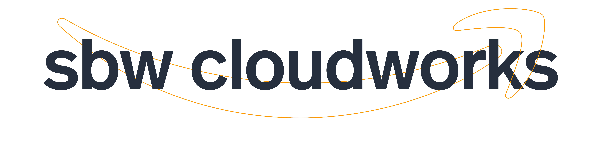
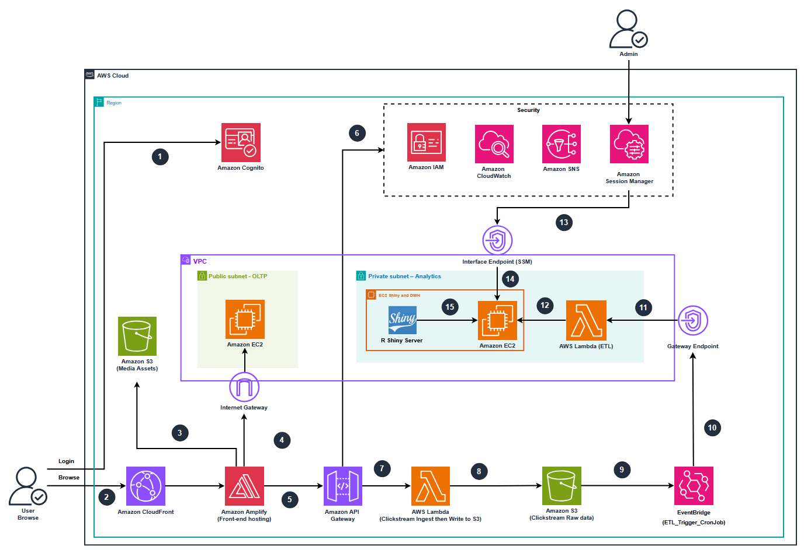
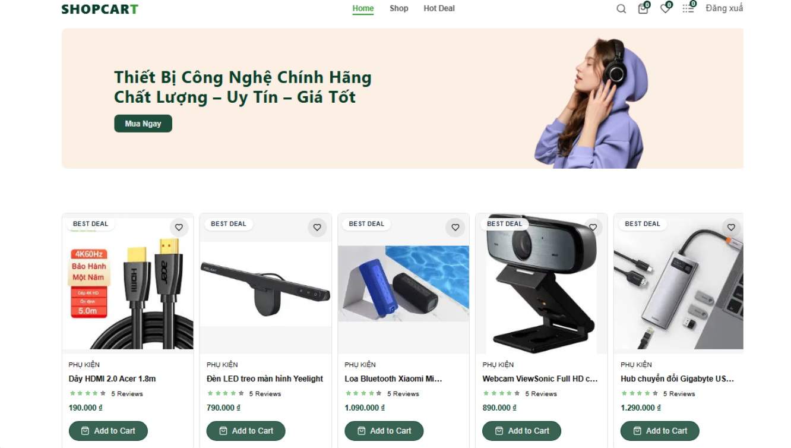
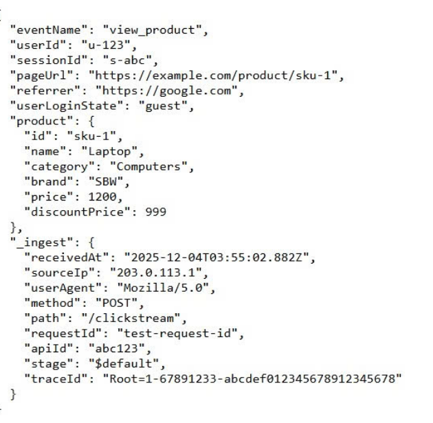
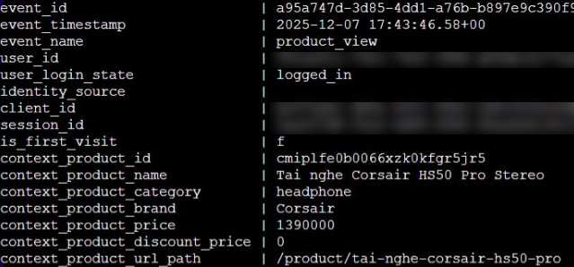
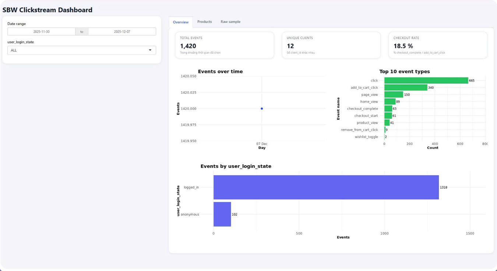
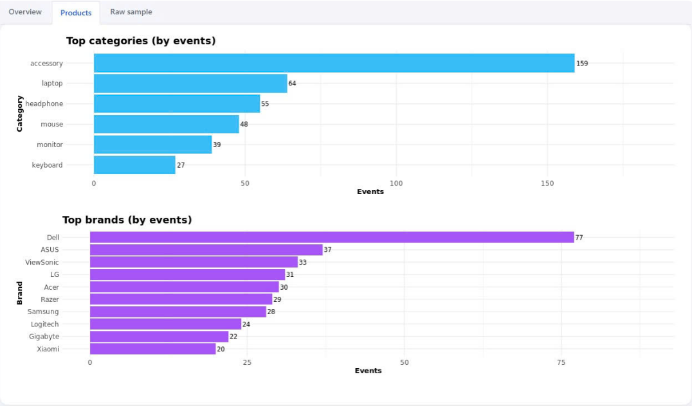
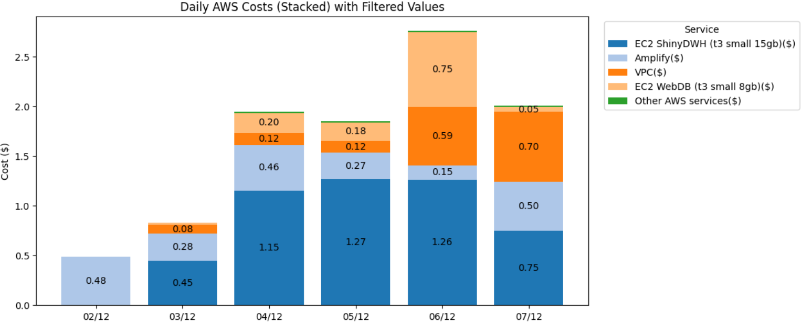
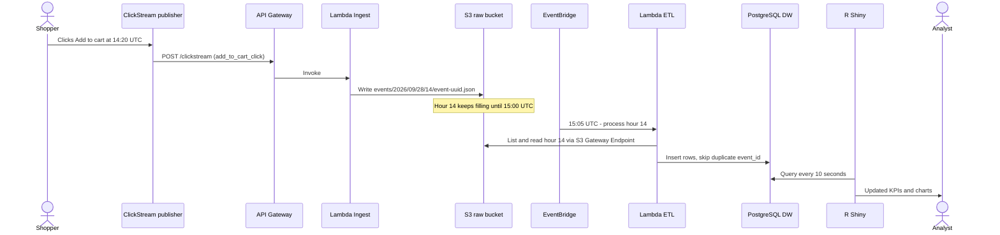
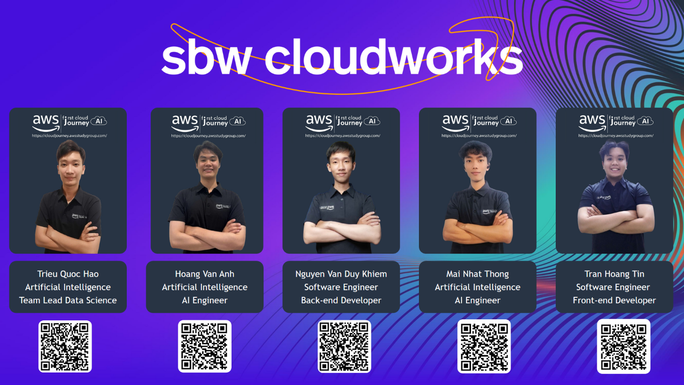

<h1 align="center">Clickstream Analytics Platform for E-Commerce</h1>

<b>Turn raw shopper behavior into trusted, hourly business insight - on a private, cost-first AWS pipeline.</b>

Batch ETL • AWS Serverless • PostgreSQL Data Warehouse • R Shiny Analytics

<a href="https://github.com/SBW-Cloudworks/ClickSteam.NextJS">Storefront</a> • <a href="https://github.com/SBW-Cloudworks/ClickStream.Lambda">Data pipeline</a> • <a href="https://github.com/SBW-Cloudworks/ClickSteam.RShiny">Dashboard</a> • <a href="https://github.com/SBW-Cloudworks/ClickStream.LocalStack-Terraform">Local environment</a> • <a href="https://the-khiem7.github.io/AWS.FirstCloudJourney/5-workshop/">Workshop</a>

**On this page:** [The problem](#-the-problem) · [How we solve it](#-how-we-solve-it) · [What it costs](#-what-it-costs) · [How the pipeline runs](#-how-the-pipeline-runs) · [AWS services and the problem each solves](#-aws-services-and-the-problem-each-solves) · [Technical deep dive](#-technical-deep-dive) · [Roadmap](#-roadmap) · [Repositories](#-repositories)

---

## The problem

**Every click tells a story. Most online shops cannot read it.**

E-commerce teams rarely lack data. What they lack is a reliable way to turn scattered shopper behavior into decisions - at the right time, in the right context, and on infrastructure they can actually run. Once a business takes behavior-driven marketing seriously, the same questions keep coming up:

**"Where exactly do shoppers give up?"**

Product views, clicks, add-to-cart and checkout are recorded in different places and in different shapes. Nobody can draw the full journey, so the drop-off points stay a guess.

**"Why did last week's numbers change?"**

Every feature and every release sends events its own way. The same report gives different answers over time, and the business slowly stops trusting the dashboard.

**"Can we fix this report without breaking history?"**

With no original copy of the data underneath, every change to the processing logic is a gamble. Numbers cannot be audited, errors cannot be traced, and past data cannot be replayed.

**"Can analytics run safely inside a locked-down network?"**

Real environments keep databases in private networks, with no SSH and strict isolation. Setups that work in a demo often break once the doors are closed.

**"Do we really need a streaming platform for hourly decisions?"**

Always-on streaming stacks, NAT gateways and managed warehouses cost far more than a team that decides hour by hour can justify.

> **Scope.** The storefront - sign-in, browsing, cart and checkout - is the foundation of a working e-commerce site. The heart of this project is what we built on top of it: the **clickstream pipeline**, **batch processing**, **data warehouse** and **analytics dashboard**.

 The SHOPCART storefront - every browse, click and add-to-cart here becomes a clickstream event.

---

## How we solve it

We built a **batch-based clickstream analytics platform** that puts data discipline, day-to-day operability and cost ahead of novelty. Each answer below mirrors one of the questions above.

**One event language, from browser to dashboard.**

A single publisher built into the storefront sends every interaction in the same shape, tied to the same shopper, browser and session. For the first time, the shopper journey can be drawn end to end.

**The same numbers, every release.**

A fixed event contract is enforced twice - once in the browser and once in the warehouse schema - and every event is stamped with one trusted server clock. Last week's report means the same thing today.

**Every raw click is kept.**

Events land untouched in Amazon S3, filed by hour, before anything transforms them. Any report can be rebuilt and any hour replayed, without ever touching the original data.

<table>
<tr>
<td width="50%" align="center"></td>
<td width="50%" align="center"></td>
</tr>
<tr>
<td align="center">Raw event in S3 - the original payload plus server metadata</td>
<td align="center">Curated row in the warehouse - one fixed schema for every event (IDs blurred)</td>
</tr>
</table>

**Private by default, and still easy to run.**

The warehouse, the processing and the dashboard have no public address. The team manages them through AWS Systems Manager without SSH, and an email alert goes out as soon as a pipeline run fails.

**Hourly batches, pay-per-use.**

Processing runs once an hour - the pace at which marketing and product teams actually make decisions - on serverless compute that costs nothing while idle. No NAT gateway, no streaming cluster.

### What the business sees

The R Shiny dashboard reads straight from the data warehouse and refreshes every 10 seconds:

- **KPI cards** - Total events, Unique clients, Checkout rate (`checkout_complete` ÷ `add_to_cart_click`).
- **Overview** - Events over time, Top 10 event types, Events by login state (logged-in vs anonymous shoppers).
- **Products** - Top categories and Top brands by engagement.
- **Raw sample** - the latest product events, paged and newest first, for spot checks.
- **Filters** - date range and user login state.

 Overview tab - KPI cards, events over time, top event types and events by login state

 Products tab - top categories and top brands by shopper engagement

---

## What it costs

Cost-first is not a slogan - these are the real AWS bills from our development and demo period in December 2025.

| Item                                                    | Cost                |
| ------------------------------------------------------- | ------------------- |
| **Total development cost**                        | **36.29 USD** |
| AWS Amplify Hosting (storefront)                        | 5.00 USD / month    |
| Amazon EC2 t3.small, 15 GB (data warehouse + dashboard) | 10.20 USD / month   |
| Amazon EC2 t3.small, 8 GB (store database)              | 9.36 USD / month    |

The serverless pieces - API Gateway, both Lambda functions, EventBridge and S3 - barely register on the bill, because they cost nothing while the store is quiet.

 Daily AWS cost by service during development (2-7 December 2025)

---

## How the pipeline runs

The numbers below match the numbered circles in the diagram.

### A. Shop - the storefront foundation

| Step | What happens                                                                                                           | Services                                               |
| ---- | ---------------------------------------------------------------------------------------------------------------------- | ------------------------------------------------------ |
| 1    | The shopper signs in. Cognito issues tokens, and the shopper's Cognito user ID becomes`userId` on every later event. | Amazon Cognito                                         |
| 2    | The shopper opens the store. CloudFront serves the Next.js app hosted on Amplify.                                      | Amazon CloudFront, AWS Amplify Hosting                 |
| 3    | Product images and media load from S3.                                                                                 | Amazon S3 (media assets)                               |
| 4    | Server-side pages read products, carts and orders from the OLTP PostgreSQL database through the Internet Gateway.      | AWS Amplify (SSR), Internet Gateway, Amazon EC2 (OLTP) |

### B. Collect - every interaction becomes a raw event

| Step | What happens                                                                                                                                                                                          | Services                                    |
| ---- | ----------------------------------------------------------------------------------------------------------------------------------------------------------------------------------------------------- | ------------------------------------------- |
| 5    | The ClickStream publisher in the browser sends each interaction as one JSON event, with client, session, user and product context attached.                                                           | ClickStream publisher → Amazon API Gateway |
| 7    | API Gateway receives`POST /clickstream` and invokes Lambda Ingest.                                                                                                                                  | Amazon API Gateway (HTTP API), AWS Lambda   |
| 8    | Lambda Ingest checks the request, adds server metadata (receive time, request ID, trace ID, source IP, user agent) and writes the event unchanged to`events/YYYY/MM/DD/HH/event-<uuid>.json` (UTC). | AWS Lambda (Ingest), Amazon S3 (raw)        |

### C. Transform - hourly batch ETL into the warehouse

| Step | What happens                                                                                                                                                       | Services                                                  |
| ---- | ------------------------------------------------------------------------------------------------------------------------------------------------------------------ | --------------------------------------------------------- |
| 9    | Each closed UTC hour of raw events becomes one batch for the scheduler.                                                                                            | Amazon S3 (raw)                                           |
| 10   | At minute 5 of every hour, EventBridge triggers Lambda ETL for the previous full hour.                                                                             | Amazon EventBridge                                        |
| 11   | Lambda ETL runs in the private subnet and reads that hour's raw objects through the S3 Gateway Endpoint - no internet path.                                        | S3 Gateway VPC Endpoint, AWS Lambda (ETL)                 |
| 12   | ETL maps each event to the warehouse contract, flattens the product context and inserts rows into`clickstream_events`, skipping any `event_id` already loaded. | AWS Lambda (ETL), PostgreSQL Data Warehouse on Amazon EC2 |

### D. Analyze and operate

| Step | What happens                                                                                                                                      | Services                                  |
| ---- | ------------------------------------------------------------------------------------------------------------------------------------------------- | ----------------------------------------- |
| 15   | R Shiny, on the same instance as the warehouse, queries PostgreSQL over localhost and renders the dashboard.                                      | R Shiny Server, PostgreSQL Data Warehouse |
| 13   | An admin opens a Session Manager session - no SSH keys, no bastion host.                                                                          | AWS Systems Manager Session Manager       |
| 14   | Session traffic reaches the private EC2 instance through the SSM interface endpoint, with port forwarding to the dashboard or the database.       | SSM Interface VPC Endpoint, Amazon EC2    |
| 6    | API Gateway and both Lambda functions log to CloudWatch. Alarms email the IT/ops team through SNS. IAM roles limit what each component can touch. | Amazon CloudWatch, Amazon SNS, AWS IAM    |

### Life of one click

---

## 🧩 AWS services and the problem each solves

Every service in the platform earns its place by removing a concrete problem for the business.

### Shop - the storefront foundation

| Service                                | What it does for us                                                       | The problem it removes                                                                            |
| -------------------------------------- | ------------------------------------------------------------------------- | ------------------------------------------------------------------------------------------------- |
| **Amazon Cognito**               | Signs shoppers up and in.                                                 | Behavior is tied to a real customer across sessions and devices, not to an anonymous browser tab. |
| **AWS Amplify Hosting**          | Builds and hosts the storefront, with the ClickStream publisher built in. | Every page reports behavior the same way, and there are no web servers to run.                    |
| **Amazon CloudFront**            | Delivers the storefront to shoppers.                                      | Pages load fast wherever the shopper is.                                                          |
| **Amazon S3 (media assets)**     | Stores product images and media.                                          | Store content is kept safely at low cost.                                                         |
| **Amazon EC2 (OLTP PostgreSQL)** | Runs the store's day-to-day database for users, products and orders.      | Orders and checkout stay apart from analytics, so reports never slow down sales.                  |

### Collect - every interaction becomes a raw event

| Service                                 | What it does for us                                      | The problem it removes                                                               |
| --------------------------------------- | -------------------------------------------------------- | ------------------------------------------------------------------------------------ |
| **Amazon API Gateway (HTTP API)** | Gives every event one public door,`POST /clickstream`. | All behavior data enters in one place, and cost grows only with traffic.             |
| **AWS Lambda (Ingest)**           | Checks each event, stamps the server time and stores it. | Every event runs on one trusted clock, and nothing is paid while the store is quiet. |
| **Amazon S3 (raw clickstream)**   | Keeps every raw event, filed by hour.                    | The original data is always there to audit, debug or rebuild any report.             |

### Transform - hourly processing into the warehouse

| Service                           | What it does for us                                     | The problem it removes                                                                                  |
| --------------------------------- | ------------------------------------------------------- | ------------------------------------------------------------------------------------------------------- |
| **Amazon EventBridge**      | Starts processing at minute 5 of every hour.            | No scheduler server to keep alive, and every run covers a fixed hour that can be replayed.              |
| **AWS Lambda (ETL)**        | Turns one hour of raw events into clean warehouse rows. | Every event follows the same schema, duplicates are skipped, and any hour can be reprocessed on demand. |
| **S3 Gateway VPC Endpoint** | Gives processing a private road to the raw data.        | Data never crosses the internet, and no NAT gateway is needed.                                          |

### Analyze and operate

| Service                                        | What it does for us                                                   | The problem it removes                                                                   |
| ---------------------------------------------- | --------------------------------------------------------------------- | ---------------------------------------------------------------------------------------- |
| **Amazon VPC (private subnet)**          | Hosts the warehouse, dashboard and processing with no public address. | Analytics data cannot be reached from the internet.                                      |
| **Amazon EC2 (PostgreSQL DW + R Shiny)** | Runs the data warehouse and the dashboard on one server.              | The whole customer journey is answered in one place, on a single low-cost server.        |
| **AWS Systems Manager Session Manager**  | Lets admins work on the private server through private endpoints.     | Safe maintenance with no SSH keys, no bastion host and no open ports.                    |
| **AWS IAM**                              | Gives each function only the access it needs.                         | No pipeline step can alter the original raw data.                                        |
| **Amazon CloudWatch**                    | Collects logs and metrics, and raises alarms.                         | The team sees which step failed and why, instead of digging through servers.             |
| **Amazon SNS**                           | Emails the IT/ops team when an alarm fires.                           | Nobody has to watch logs, and a failed hour is fixed and replayed before data is missed. |

---

📘 **Step-by-step workshop:** [AWS First Cloud Journey - Clickstream workshop](https://the-khiem7.github.io/AWS.FirstCloudJourney/5-workshop/)

---

## 👥 The team

